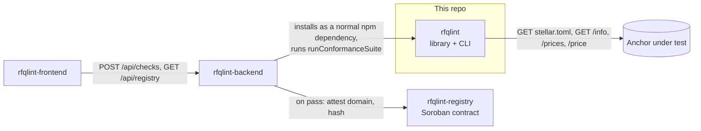
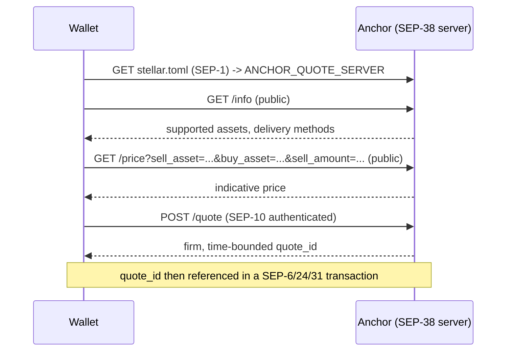
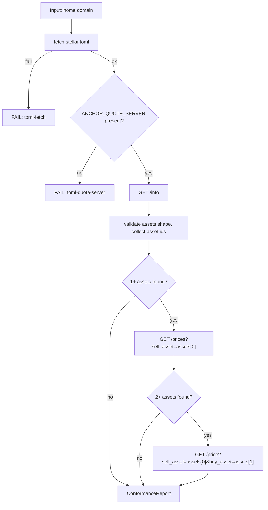
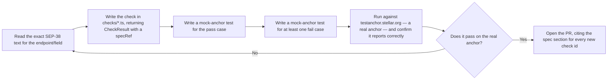

# rfqlint

A conformance checker for [SEP-38](https://github.com/stellar/stellar-protocol/blob/master/ecosystem/sep-0038.md)
(Anchor RFQ / quote server) implementations on Stellar. Point it at a
domain; it tells you exactly where that anchor's quote server diverges
from spec, with a reference back to the relevant section of the SEP for
every failure.

This is the foundational piece of a four-repo project, mirroring
[`sep24-conformance`](https://github.com/SEP-24-conform/sep24-conformance)'s
and [`sep31-conformance`](https://github.com/sep31-conformance/sep31-conformance)'s
exact project shape, applied to SEP-38:

- **This repo** — the checking library + CLI.
- [`rfqlint-registry`](https://github.com/RFQLint/rfqlint-registry) — a Soroban contract storing on-chain, admin-signed conformance results.
- [`rfqlint-backend`](https://github.com/RFQLint/rfqlint-backend) — an API service that runs this checker and publishes passing results to that contract.
- `rfqlint-frontend` — dashboard over that backend (link to follow once pushed).



This repo has no dependency on any of them — a standalone library and CLI
useful on its own, and the shared core the others are built on.

## Table of contents

- [Why this exists](#why-this-exists)
- [Glossary](#glossary)
- [Background: what SEP-38 actually is](#background-what-sep-38-actually-is)
- [How the check works](#how-the-check-works)
- [Installation](#installation)
- [CLI usage](#cli-usage)
- [Library usage](#library-usage)
- [Check reference](#check-reference)
- [Annotated sample /info response](#annotated-sample-info-response)
- [Common ways anchors fail this check](#common-ways-anchors-fail-this-check)
- [Why /prices and /price accept a well-formed error as a pass](#why-prices-and-price-accept-a-well-formed-error-as-a-pass)
- [A real bug this tool found in SDF's own reference anchor](#a-real-bug-this-tool-found-in-sdfs-own-reference-anchor)
- [How SEP-38 relates to SEP-24 and SEP-31](#how-sep-38-relates-to-sep-24-and-sep-31)
- [Project layout](#project-layout)
- [Development](#development)
- [Design decisions](#design-decisions)
- [What this doesn't check (yet)](#what-this-doesnt-check-yet)
- [Adding a new check](#adding-a-new-check)
- [FAQ](#faq)
- [Contributing](#contributing)
- [License](#license)

## Why this exists

SEP-38 defines the "Anchor RFQ" API — how a wallet or another anchor asks
"what would it cost to exchange asset A for asset B right now?" and gets
back a firm, time-bounded quote it can reference in a SEP-6, SEP-24, or
SEP-31 transaction. It's the pricing layer underneath the payment flows
[`sep24-conformance`](https://github.com/SEP-24-conform/sep24-conformance)
and [`sep31-conformance`](https://github.com/sep31-conformance/sep31-conformance)
already check — and, per the research that motivated this whole line of
projects, one more SEP with essentially no independent tooling: SEP-31's
own README documents `ANCHOR_QUOTE_SERVER` being *referenced* by
`quote_id`, but explicitly scoped checking the quote server itself out as
its own project. This is that project.

## Glossary

| Term | Meaning |
|---|---|
| **`ANCHOR_QUOTE_SERVER`** | The `stellar.toml` field advertising an anchor's SEP-38 base URL. |
| **Firm quote** | A time-bounded, guaranteed exchange rate returned by `POST /quote` — as opposed to the indicative (non-binding) rates `GET /price`/`GET /prices` return. |
| **Indicative price** | A non-binding estimate — what `GET /price` and `GET /prices` return, no SEP-10 session required. |
| **Delivery method** | How an off-chain (fiat) asset is delivered — e.g. `WIRE`, `SEPA` — declared per-asset in `GET /info`. |
| **Asset identification format** | SEP-38's asset string format: `stellar:native`, `stellar:<CODE>:<ISSUER>`, or `iso4217:<3-letter code>`. |

## Background: what SEP-38 actually is

If you already know this, skip to [How the check works](#how-the-check-works).



Unlike SEP-24's `/info` (unauthenticated) and SEP-31's `/info`
(also unauthenticated but that's the *only* public endpoint of substance),
SEP-38 has a genuinely larger public surface: `GET /info`, `GET /prices`,
and `GET /price` are **all** unauthenticated per spec. Only `POST /quote`
and `GET /quote/:id` require a SEP-10 session. That's why this checker
covers more ground than either sibling project without needing to
implement SEP-10 at all.

## How the check works



The `/prices` and `/price` checks are **derived**: they're not static
shape checks against a fixed endpoint, they construct a real query from
whatever assets `/info` actually returned, then validate the response
shape. See
[Why /prices and /price accept a well-formed error as a pass](#why-prices-and-price-accept-a-well-formed-error-as-a-pass)
for an important nuance in how "pass" is defined for those two.

## Installation

Not yet published to npm. Run it without installing:

```sh
npx github:RFQLint/rfqlint check <homeDomain>
```

Or add it as a dependency in another project:

```sh
npm install github:RFQLint/rfqlint
```

## CLI usage

```sh
rfqlint check <homeDomain> [--json]
```

Real output against SDF's own reference anchor:

```console
$ rfqlint check testanchor.stellar.org
SEP-38 conformance report for testanchor.stellar.org
Anchor quote server: https://testanchor.stellar.org/sep38

✔ [PASS] stellar.toml is reachable and valid TOML
✔ [PASS] stellar.toml declares ANCHOR_QUOTE_SERVER
✔ [PASS] GET /info is reachable
✔ [PASS] /info returns valid JSON
✔ [PASS] assets is present and every entry has a valid shape
✔ [PASS] GET /prices responds with a well-formed result for a derived query (success or spec-shaped error)
✘ [FAIL] /price returns valid JSON
    HTTP 502, and the body failed to parse as JSON: Unexpected token '<', "<!DOCTYPE "... is not valid JSON

6 passed, 1 failed, 0 warnings
```

That failure is real, current, reproducible output — see
[A real bug this tool found in SDF's own reference anchor](#a-real-bug-this-tool-found-in-sdfs-own-reference-anchor).

`--json` emits the full report as JSON; the process exits non-zero if any
check `fail`s.

## Library usage

```ts
import { runConformanceSuite, formatText } from "rfqlint";

const report = await runConformanceSuite("testanchor.stellar.org");
console.log(formatText(report));
```

| Export | Description |
|---|---|
| `runConformanceSuite(homeDomain)` | Full suite: toml → `ANCHOR_QUOTE_SERVER` → `/info` → derived `/prices` and `/price` checks. |
| `checkInfoEndpoint(quoteServer)` | Just the `/info` shape checks. Returns discovered asset ids alongside results. |
| `checkPricesEndpoint(quoteServer, assetIds)` | Derived `/prices` check — needs at least 1 discovered asset. |
| `checkPriceEndpoint(quoteServer, assetIds)` | Derived `/price` check — needs at least 2 discovered assets. |
| `isValidAssetId(value)` | Type guard for the SEP-38 asset identifier format. |
| `formatText(report)` / `formatJson(report)` | Report rendering. |
| `StellarTomlError` | Thrown by `fetchStellarToml`. |

## Check reference

| id | Checks | Spec |
|---|---|---|
| `toml-fetch` | `stellar.toml` reachable and valid TOML | SEP-1 |
| `toml-quote-server` | `ANCHOR_QUOTE_SERVER` declared | SEP-38 |
| `info-reachable`, `info-json` | `GET /info` reachable, valid JSON | SEP-38 §GET /info |
| `info-shape` | `assets` array present (warns if empty) | SEP-38 §GET /info |
| `info-asset-<i>-id` | Each `asset` matches `stellar:native`, `stellar:<CODE>:<ISSUER>`, or `iso4217:<CODE>` | SEP-38 §GET /info |
| `info-<asset>-{sell,buy}_delivery_methods` | Array of `{name, description?}` if present | SEP-38 §GET /info |
| `info-<asset>-country_codes` | Array of strings if present | SEP-38 §GET /info |
| `prices-reachable`, `prices-json`, `prices-shape` | Derived `GET /prices` query returns a well-formed result | SEP-38 §GET /prices |
| `price-reachable`, `price-json`, `price-shape` | Derived `GET /price` query returns a well-formed result (all required string fields + `fee.total`/`fee.asset`) | SEP-38 §GET /price |

## Annotated sample /info response

Real shape (trimmed), matching what `testanchor.stellar.org` actually
returns:

```jsonc
{
  "assets": [
    { "asset": "stellar:native" },                    // Stellar asset: no issuer needed
    { "asset": "stellar:USDC:GBBD...LLFLA5" },         // Stellar asset: CODE:ISSUER
    {
      "asset": "iso4217:USD",                          // fiat asset
      "country_codes": ["US"],                          // optional: ISO 3166 codes
      "sell_delivery_methods": [                         // optional, off-chain assets only
        { "name": "WIRE", "description": "Send USD directly to the Anchor's bank account." }
      ],
      "buy_delivery_methods": [
        { "name": "WIRE", "description": "Have USD sent directly to your bank account." }
      ]
    }
  ]
}
```

Only `asset` is required per entry; everything else is optional and
type-checked if present, not required. This checker's `checkInfoEndpoint`
also returns the discovered `assetIds` in listed order — `assets[0]` and
`assets[1]` from this exact response are what get fed into the derived
`/prices` and `/price` checks (see below).

## Common ways anchors fail this check

Patterns worth watching for, based on what `checks/*.ts` actually guards
against:

| Symptom | Likely cause |
|---|---|
| `toml-quote-server` fails | `stellar.toml` served, but `ANCHOR_QUOTE_SERVER` not declared — often because SEP-38 support was added without updating `stellar.toml`, or only `quotes_supported` was set in a SEP-31 `/info` response with nothing backing it. |
| `info-asset-<i>-id` fails | An asset string doesn't match the three valid forms — e.g. a bare `USDC` instead of `stellar:USDC:G...`, or an issuer address that's the wrong length. |
| `prices-shape` / `price-shape` fail with a real HTTP status in the message | The derived query reached the server but got back neither a valid success shape nor a well-formed `{error}` — see [A real bug this tool found in SDF's own reference anchor](#a-real-bug-this-tool-found-in-sdfs-own-reference-anchor) for exactly this happening against a real anchor. |
| `price-shape` never runs at all | Fewer than 2 assets were discovered in `/info` — the check needs a sell/buy pair and is silently skipped (no result emitted) rather than failing, since "only 1 asset configured" isn't itself a SEP-38 violation. |

## Why /prices and /price accept a well-formed error as a pass

Unlike the static shape checks (`/info`), the `/prices` and `/price`
checks construct a *synthetic* query — the first (or first two) asset ids
discovered from `/info`, with an arbitrary probe amount (`sell_amount=1`).
Nothing guarantees that specific query is actually answerable: an anchor
might reject a `1`-unit trade as below its minimum, or the two assets
picked might not form a corridor the anchor actually supports pricing
between.

So these checks validate **response shape**, not that the query
necessarily succeeds: a `200` with the correct success shape passes, and
so does a non-`200` with a well-formed `{ "error": string }` body — both
are evidence the endpoint is behaving correctly. Only a response that's
neither (not valid JSON, or missing required fields) counts as a genuine
conformance failure. This is deliberately different from how `/info` is
checked, and is documented here because it's the least obvious design
choice in this codebase.

## A real bug this tool found in SDF's own reference anchor

Verifying this tool's `/price` check against `testanchor.stellar.org`
didn't return a shape mismatch — it returned an HTML error page where
JSON was expected:

```console
$ curl -s "https://testanchor.stellar.org/sep38/price?sell_asset=stellar:native&buy_asset=iso4217:USD&sell_amount=1&context=sep6"
error code: 502
```

Confirmed reproducible (three consecutive requests, all `502`, all from
Cloudflare in front of the anchor, not the origin server) — this is a
genuine, currently-live infrastructure problem with SDF's own reference
anchor's `/sep38/price` endpoint, not a bug in this tool's request
construction (`/sep38/info` and `/sep38/prices` on the same anchor work
correctly). The first version of the failure message here was an opaque
`Failed to parse JSON: Unexpected token '<'...` — genuinely true, but
unhelpful for diagnosing *why*. Fixed to include the actual HTTP status
(`HTTP 502, and the body failed to parse as JSON: ...`) before this was
trusted, and a regression test
(`test/checks/price.test.ts`, "gives a clear message... when the body
isn't JSON at all") reproduces this exact failure mode against a local
mock server so it can't silently regress.

## How SEP-38 relates to SEP-24 and SEP-31

| SEP | What it defines | Auth on discovery endpoints |
|---|---|---|
| [SEP-24](https://github.com/stellar/stellar-protocol/blob/master/ecosystem/sep-0024.md) | Interactive deposit/withdraw | `/info` public |
| [SEP-31](https://github.com/stellar/stellar-protocol/blob/master/ecosystem/sep-0031.md) | Direct anchor-to-anchor payment | `/info` public |
| **SEP-38** (this repo) | Exchange-rate quotes, referenced by SEP-6/24/31's `quote_id` | `/info`, `/prices`, **and** `/price` all public |

This project only covers the public surface. `POST /quote` and
`GET /quote/:id` require a SEP-10 session — see
[What this doesn't check (yet)](#what-this-doesnt-check-yet).

## Project layout

```text
src/
  toml.ts             SEP-1 stellar.toml fetch + parse
  checks/info.ts        /info shape validation, asset id format, delivery methods
  checks/prices.ts       derived GET /prices check
  checks/price.ts        derived GET /price check
  report.ts             text/JSON report formatting
  index.ts              library entry point, orchestrates all checks
  cli.ts                commander-based CLI
test/
  toml.test.ts
  index.test.ts
  checks/info.test.ts
  checks/prices.test.ts
  checks/price.test.ts   includes the real-bug regression test above
  fixtures/mock-anchor.ts
```

## Development

```sh
npm install
npm run build
npm test         # 25 tests, all against a local mock anchor
npm run dev       # tsx src/cli.ts
```

Every check was also manually verified against SDF's real
`testanchor.stellar.org` before being trusted — including the real
`/price` 502 documented above, discovered by that exact verification
step rather than assumed away.

## Design decisions

**Why derive `/prices` and `/price` queries from discovered assets
instead of requiring the caller to supply them?** A conformance checker
that needs you to already know an anchor's supported assets before you
can check it defeats much of the point — deriving the query from `/info`
means `rfqlint check <domain>` alone is enough, same
zero-configuration ergonomics as the sibling checkers.

**Why treat a well-formed error response as a pass for `/prices`/`/price`
but not for `/info`?** `/info` has no inputs — a request to it can only
succeed or be genuinely broken. `/prices`/`/price` take a synthetic query
this tool invented, which isn't guaranteed answerable — see
[Why /prices and /price accept a well-formed error as a pass](#why-prices-and-price-accept-a-well-formed-error-as-a-pass).

**Why validate asset identifiers with a regex instead of a full SEP-11
strkey checksum validation?** The regex (`G[A-Z2-7]{55}` for issuer
addresses) checks the *shape* a valid Stellar address has, not that its
checksum is actually valid — full strkey validation would need to depend
on `@stellar/stellar-sdk` for a single regex-shaped check. Given this
project has zero runtime dependencies beyond `commander` and `smol-toml`,
that trade-off wasn't taken for v1 — tracked as a possible future
tightening, not a currently-known false-pass risk (a malformed-but-shape-matching
issuer address would still fail elsewhere, since it wouldn't correspond
to a real account).

## What this doesn't check (yet)

- `POST /quote` and `GET /quote/:id` — both require a SEP-10 session,
  same authenticated-endpoint scope gap the sibling checkers have.
- Full SEP-11 strkey checksum validation on Stellar asset issuer
  addresses (see [Design decisions](#design-decisions)).
- Firm-quote expiration/`context` validation logic — this checker
  confirms shape, not that returned prices are numerically sane or that
  `expires_at` behaves correctly over time.

## Adding a new check

Same discipline as both sibling checkers
([`sep24-conformance`](https://github.com/SEP-24-conform/sep24-conformance#adding-a-new-check),
[`sep31-conformance`](https://github.com/sep31-conformance/sep31-conformance#adding-a-new-check)):



Step E is exactly what caught the real `/price` 502 documented above — a
new check that only passes its own mock tests hasn't been proven against
anything except an assumption it encodes itself. `POST /quote` and
`GET /quote/:id` (see [Contributing](#contributing)) are the clearest
places to apply this next, since they need a SEP-10 client this project
doesn't have yet.

## FAQ

**Does a `/price` or `/prices` failure always mean the anchor is
broken?** Usually yes at the shape level, but see
[Why /prices and /price accept a well-formed error as a pass](#why-prices-and-price-accept-a-well-formed-error-as-a-pass) —
a `fail` here means the response was neither a valid success shape nor a
valid spec-shaped error, which is a genuine problem either way.

**Why does this tool have no runtime dependency on `@stellar/stellar-sdk`,
unlike the backend projects in this line of work?** This is a pure HTTP
conformance checker — it never builds a Soroban transaction or signs
anything, so it never needed the SDK. Keeping it dependency-light is
deliberate, not an oversight.

**Can this check a sending-side wallet instead of an anchor?** No — SEP-38
defines the anchor's server API; a wallet is a client of it with no
discoverable server surface to check.

## Contributing

`POST /quote`/`GET /quote/:id` support (the SEP-10-authenticated half of
this SEP) is the clearest next step — same standard as this project's
sibling checkers: verify any new check against a real anchor, not only a
mock, before trusting it.

## License

Apache-2.0
